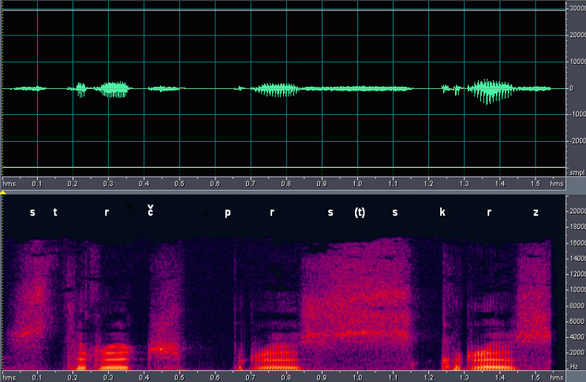
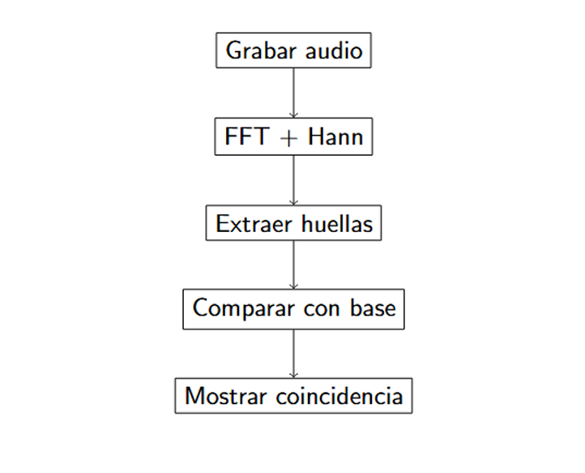
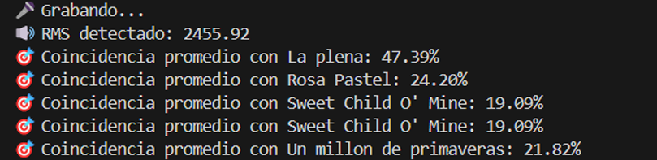

# 🎵 Reconocimiento de Canciones en Tiempo Real (Audio Fingerprinting)

## 📌 Descripción General
Este proyecto implementa un sistema de reconocimiento automático de canciones en tiempo real, simulando el núcleo algorítmico de aplicaciones comerciales como Shazam[cite: 1]. Utiliza conceptos avanzados de procesamiento digital de señales para identificar música a partir de una breve grabación capturada por el micrófono[cite: 1].

El desarrollo se llevó a cabo para la asignatura de Matemáticas Especiales en la Universidad Católica de Oriente, demostrando la aplicación de modelos matemáticos abstractos en soluciones de software del mundo real[cite: 1].

## 🧠 Base Matemática y Algorítmica

El reconocimiento se logra trasladando la señal de audio del dominio del tiempo al dominio de la frecuencia[cite: 1].

1. **Enventanado (Windowing):** La señal de audio se divide en segmentos de 1 segundo con un traslape (overlap) del 50%[cite: 1]. A cada ventana se le aplica una **función de Hann** para suavizar los bordes y reducir los artefactos espectrales[cite: 1].
2. **Transformada de Fourier (FFT):** Se aplica el algoritmo de la Transformada Rápida de Fourier, reduciendo la complejidad computacional a \(\mathcal{O}(N \log N)\)[cite: 1]. Esto permite obtener el espectro de frecuencias en tiempo real[cite: 1].

*Figura 1: Ejemplo de espectrograma generado a partir de una señal de audio analizada[cite: 1].*

3. **Huellas Digitales (Fingerprints):** De cada ventana espectral se extraen los picos de frecuencia con mayor energía[cite: 1]. Estos picos forman una firma única para cada canción, almacenada en un archivo `.fp` mediante índices separados por barras (ej. `203|410|589|710`)[cite: 1].

## ⚙️ Arquitectura del Sistema

El flujo de trabajo automatiza desde la captura del audio hasta la respuesta al usuario[cite: 1]:

*Figura 2: Diagrama de flujo general del proceso de reconocimiento[cite: 1].*

## 💻 Implementación Técnica

El sistema está desarrollado con una arquitectura modular centralizada en el archivo `shazam_realtime.py`[cite: 1].

* **Lenguaje:** Python 3.12[cite: 1].
* **Cálculo Numérico y Procesamiento:** `numpy`, `scipy`[cite: 1].
* **I/O de Audio:** `sounddevice` (captura a 44100 Hz), `playsound` (reproducción en procesos paralelos)[cite: 1].
* **Interfaz Gráfica y Feedback:** `tkinter` (UI), `pyttsx3` (Síntesis de voz)[cite: 1].

## 📊 Resultados y Rendimiento

El algoritmo compara las huellas de la grabación temporal contra una base de datos local[cite: 1]. Si el índice de similitud supera el umbral del 45%, se detecta una coincidencia[cite: 1].

* **Precisión:** Se alcanzó un promedio de reconocimiento exitoso del **85%** en condiciones de grabación controladas[cite: 1].
* **Limitaciones:** El sistema es sensible al ruido ambiental y la precisión disminuye si la muestra de audio capturada es demasiado corta (menor a 12 segundos)[cite: 1].

*Figura 3: Captura de la interfaz mostrando el porcentaje de coincidencia durante un reconocimiento exitoso[cite: 1].*

## 👨‍💻 Autor
**Tomás Gómez Cifuentes**[cite: 1]  
Estudiante de Ingeniería de Sistemas | Universidad Católica de Oriente[cite: 1]
